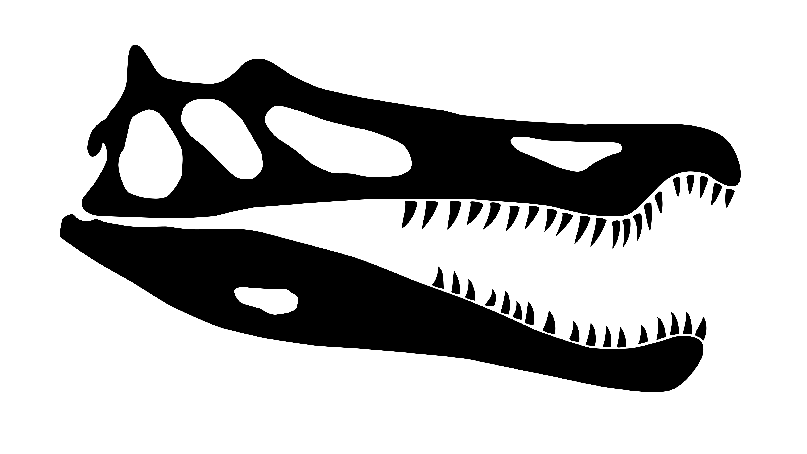

# Project Baryonyx
Project Baryonyx is loosely focused around the restoration of a 1994 Jeep Wrangler YJ - including all the pitfalls, caveats and bits and pieces I feel could be documented for others

# Contents
## Body and Paint
## Diagrams
So I can keep track of where cables, hoses and other things of complexity (beyond a nut and a bolt) will go, I will create diagrams that will hopefully allow me to put it all back together in the correct order. While official references might exist I either haven't found them or consider them disappointing, so this folder is where I'll store the source and PNG exports of the ones I have designed.

### Diagram List
- Intake Manifold Vacuum Connections
- Climate Control System
- Brakes, Coolant and Fuel
- Electrical Systems and Harnesses
- Vacuum Lines

I did start the electrical systems and harnesses as a way to not have to interact with the wiring diagrams in the FSM but they're actually not that bad and I don't think I am going to continue that effort (that might change, I am a fickle beast).
## Equipment and Tools
Bits and pieces that are not directly involved in the restoration but help me towards that goal will be filtered in here, including a list of tools that I am currently using and have used to aid me.

Expanding on this, I will also include plans and information on things I have fabricated to get me further - what brought this about was building a dolly for the hard top so it can be stored and worked on vertically!

### Hardtop Dolly

## Expenses
Not exhaustive and I don't think I will be considering tool and equipment purchases as part of this project (unless they are super specific and I won't be using them for anything else) but it might be of some use to keep track of how much has been spent on what in varying levels of detail.

## Hardware and Parts
This encompasses all the fixings, fasteners and everything in between including hoses, barbs and all that other wonderful stuff. This will be organised into CSV sheets that make reference to the actual Jeep Parts Catalogue

Also an non-exhaustive list of all the parts that can be identified outside of the realm of the Jeep Parts Catalogue. An example of this are the headlights which are actually Hella units (same for the front position lamps mounted on the fenders).

Of course this documentation is from the perspective of a European / UK vehicle so it might not be applicable outside of this market.

The part catalogues are readily available online for those needing a reference - I will not be including them within this project to avoid stepping on toes.

## Media

## Replacement Part Development
Now this is probably considered the meat to the bone of the project, this is where I develop my own replacement parts to ones that are missing or broken (usually by my own hand).

Given the age of the vehicle and lack of donor vehicles at scrap yards or breakers I either have to buy new and third party or order from abroad. Both of which haven't really tickled me.

### Climate Control Cables and Clips
### Climate Control Housing Modifications
### Frame Fuel and Brake Line Clips
